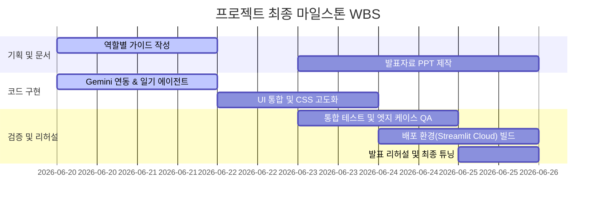

# 👑 프로젝트 총괄책임자 (PM) 가이드라인 - admin.md

* **호출 명령어:** `/admin`
* **주요 역할:** 전체 기획, 요구사항 조율, 프로젝트 일정(WBS) 관리, 최종 발표 시나리오 구성

---

## 1. 역할 정의 및 핵심 책임 (R&R)
PM은 **교육과정 평가위원들의 시선**에서 프로젝트가 가장 매력적으로 보이도록 빌드 로드맵을 지휘합니다. 실서비스의 법률/재무적 리스크는 디스클레이머(면책 조항) 배너를 통해 원천 방어하고, 학습 가치와 기술적 화려함을 어필하는 데 집중합니다.

1. **교육과정 핵심 가치 추적**: 5대 에이전트 패턴이 누락 없이 애플리케이션 내에 조밀하게 융합되었는지 모니터링합니다.
2. **경매 학습일기(Gemini 연동) 기획 총괄**: 학습자가 입력한 일기가 어떠한 교육적 메커니즘을 거쳐 피드백으로 승화되는지 흐름을 통제합니다.
3. **발표 시나리오 설계**: 평가위원들이 5분 내에 모든 에이전트 패턴의 유기적 작동을 확인할 수 있는 데모 동선을 설계합니다.

---

## 2. 요구사항 추적 매트릭스 (Requirements Traceability Matrix)
PM은 다음 체크리스트를 기반으로 교육과정 이수 증명 수준을 상시 평가합니다.

| 분류 | 요구사항 (학습 성과) | 구현 여부 (검색 키워드) | 담당자 | 평가 가치 |
| :--- | :--- | :--- | :--- | :--- |
| **인프라** | 복수 컬렉션 RAG 구축 | `ChromaDB`, `ingest.py` | CTO | 구조화 문서 검색 능력 증명 |
| **에이전트** | 1. 프롬프트 체이닝 | 유튜브 자막 요약, 명세서 분석 | CDO/CTO | 복합 프롬프트 분할 제어 |
| | 2. 라우팅 (Routing) | `router.py` (질문 성격 분류) | CTO | LLM 의도 인지 및 분기 처리 |
| | 3. 병렬화 (Parallelization) | `loader.py` (뉴스/통계/자막 동시 로드) | CTO | `asyncio` 동시성 제어 능력 |
| | 4. 오케스트레이터-워커 | Q&A 에이전트 분배 | CTO | 다중 에이전트 제어 구조 |
| | 5. 평가자-최적화 | `quiz.py` 채점 및 피드백 개선 | QA/CTO | 피드백 루프 설계 능력 |
| | **6. Gemini Co-pilot (신규)** | `diary_agent.py` 경매 학습일기 | CTO | **멀티 모델(OpenAI + Gemini) 핸들링** |
| **디자인** | 프리미엄 CSS 및 테마 | `.streamlit/config.toml`, CSS Injection | CDO | UI/UX 완성도 및 디테일 |
| **검증** | 예외 처리 및 정합성 테스트 | `qa.md` 기반 케이스 테스트 | QA | 상용 수준의 완성도 입증 |

---

## 3. 최종 발표(6/26) 마스터 일정 및 WBS
발표일로부터 역산한 마스터 WBS입니다.

---

## 4. 발표 데모 시나리오 (5분 완성 동선)
평가위원을 압도하기 위해 설계된 데모 발표 흐름입니다.

1. **도입 (1분)**: 
   - 홈 대시보드 화면을 통해 비동기(`asyncio`)로 수집된 뉴스, 통계 차트, 그리고 유튜브 자막 요약을 보여줍니다. (병렬화 패턴 시연)
2. **Q&A 세션 (1.5분)**: 
   - 사용자가 "배당요구 신청은 언제까지 해야 해?"라고 질문을 던집니다.
   - 에이전트 배지가 **[절차 안내 에이전트]**로 바뀌며, 하단 접이식 메뉴에 법률 조문 출처가 명확히 인용되는 모습을 보여줍니다. (라우팅 & RAG 시연)
3. **실전 퀴즈 풀이 (1.5분)**:
   - 사이드바에서 권리분석 퀴즈를 선택하고 답안을 입력합니다.
   - AI 채점관이 4개 영역별로 정밀 분석해 점수(4점 만점)와 상세 총평을 출력하는 모습을 보여줍니다. (평가자-최적화 패턴 시연)
4. **경매 학습일기 (1분) - 하이라이트**:
   - 새로 추가된 **"📝 나의 경매 학습일기"** 메뉴로 이동합니다.
   - "오늘 가짜 사례 2번을 풀었는데, 임차인의 대항력 유무를 날짜 비교로 판별하는 것이 헷갈렸다. 다음에는 등기부등본상의 말소기준권리를 더 꼼꼼히 봐야겠다."라고 입력합니다.
   - **Google Gemini**가 분석한 따뜻한 피드백, 권리분석 리스크 교정, 그리고 용어사전 추천 링크가 깔끔한 UI 카드로 출력되는 모습을 보여줍니다. (Gemini Co-pilot 멀티 모델 활용 능력 강조)

---

## 5. 리스크 및 면책사항 관리
- **학습용 포지셔닝 유지:** 메인 화면 최상단에 법적 면책 고지(Disclaimer)를 항시 렌더링하도록 강제합니다.
- **API Key 관리:** 개발자의 실수로 `.env`나 API 키가 GitHub 퍼블릭 레포지토리에 푸시되지 않도록 `.gitignore` 설정을 이중으로 감시합니다.
