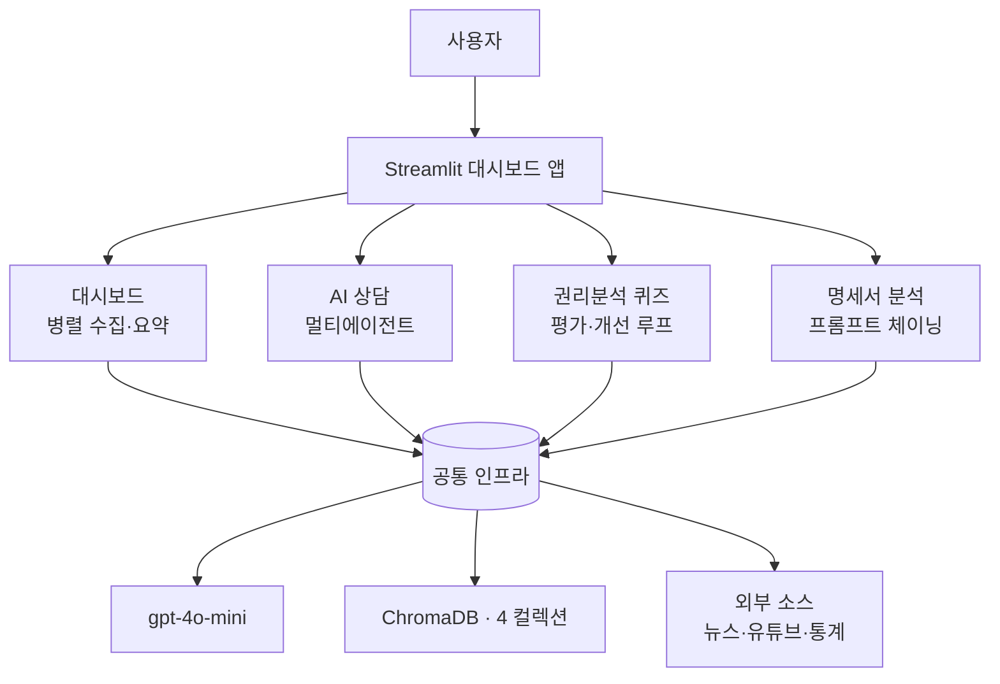

# 경매 학습·정보 플랫폼 — 기획서

> AI 에이전트 개발 교육과정 최종 프로젝트 (4인 1팀, 발표 6/26)

---

## 1. 문서 목적 & 평가 관점

본 프로젝트의 1차 목적은 **실서비스 출시가 아니라, 교육과정에서 배운 기술요소가 얼마나 충실히 반영되었는지를 입증하는 것**이다. 따라서 모든 설계 판단의 기준은 "이 기능이 어떤 커리큘럼 기술요소를 시연하는가"이다.

핵심 전략: **앤트로픽의 5대 에이전트 패턴(프롬프트 체이닝·라우팅·병렬화·오케스트레이터-워커·평가자-최적화)을 한 앱에서 모두 시연**한다. 부수적으로 RAG, 벡터DB, 웹 크롤링, 자막 요약, 데이터 시각화, Streamlit, 배포까지 폭넓게 커버한다.

---

## 2. 프로젝트 개요 (재정의)

부동산 법원경매를 주제로 한 **대시보드 중심 학습·정보 통합 플랫폼**. 첫 화면은 경매 뉴스·매각통계·유튜브 요약을 모은 대시보드이고, 그 위에 AI 상담(멀티에이전트 RAG)·권리분석 퀴즈·매각물건명세서 분석 기능을 얹는다.

- 도메인: 부동산 법원경매 (절차 + 권리분석)
- 성격: 교육·학습용 (특정 물건 투자·법률 자문 아님 / 디스클레이머 고정)

---

## 3. 참조 사이트 시사점 — 탱크옥션(tankauction.com)

메인 화면이 사실상 대시보드로 구성됨을 확인:

- 오늘의 정책 / 오늘의 뉴스 / 카페·블로그 (정보 피드)
- 동영상강좌 / 경·공매 유튜브영상 (영상 콘텐츠)
- 매각통계 / 조회수 TOP30 (통계)
- 경매퀴즈 (학습)

→ 우리 대시보드도 **뉴스 + 통계 + 유튜브(요약) + 학습 진입점**으로 구성하되, 탱크옥션에 없는 **AI 요약·AI 상담·AI 채점**을 차별점으로 둔다.

---

## 4. 시스템 아키텍처



- **대시보드**: 뉴스 크롤링 + 매각통계 차트 + 유튜브 자막 요약을 asyncio로 병렬 수집
- **AI 상담**: 라우터가 질문을 절차 안내 / 권리분석 튜터 / 법령·용어 에이전트로 분배(오케스트레이터-워커)
- **권리분석 퀴즈**: 가상 사례 출제 → 학습자 답안 LLM 채점(평가자-최적화)
- **명세서 분석**: 명세서 텍스트 → 구조화 추출 → 권리분석·위험 플래그(프롬프트 체이닝)

---

## 5. 기능 ↔ 커리큘럼 기술요소 ↔ 에이전트 패턴 매핑 (★ 발표 핵심)

| 화면/기능 | 시연 기술요소 | 에이전트 패턴 |
|---|---|---|
| 대시보드 — 경매 뉴스 | 웹 크롤링·파싱(BeautifulSoup) | — |
| 대시보드 — 매각통계 | 데이터 시각화(차트) | — |
| 대시보드 — 유튜브 요약 | 자막 추출 → 요약 → 키워드 | 프롬프트 체이닝 |
| 대시보드 — 동시 로딩 | asyncio 비동기 처리 | 병렬화 (Parallelization) |
| AI 상담 | RAG · ChromaDB · 임베딩 | 라우팅 + 오케스트레이터-워커 |
| 권리분석 퀴즈 | LLM 평가·채점 | 평가자-최적화 (Evaluator-Optimizer) |
| 명세서 분석 | 문서 구조화 추출 → 분석 | 프롬프트 체이닝 |
| 공통 | 프롬프트 엔지니어링, Streamlit, 배포 | — |

→ **5대 패턴 전부 + RAG + 크롤링 + 요약 + 시각화**를 단일 앱에서 시연. 발표 슬라이드 1장을 이 표로 구성한다.

---

## 6. 화면 구성

### 6.1 대시보드 (홈)
- **최신 경매/부동산 뉴스**: 헤드라인·출처·링크 카드 리스트 (크롤링/RSS)
- **매각통계**: 낙찰가율 추이, 물건종류별 분포, 지역별, 월별 진행/낙찰 건수 차트
- **경매 유튜브 최신 영상 + AI 요약**: 썸네일·제목 + "요약 보기" → 자막 추출 후 3~5줄 요약 + 키워드 태그

### 6.2 AI 상담 (멀티에이전트 RAG)
- 절차 안내 / 권리분석 튜터 / 법령·용어 사전
- 라우터가 질문 의도 분류 후 분배, 답변에 출처(조문) 표기

### 6.3 권리분석 퀴즈
- 난이도(입문·중급·고급) 선택 → 가상 매각물건명세서 출제
- 학습자 답안 입력 → 항목별(말소기준권리/대항력/인수·말소/위험도) 채점 + 총평

### 6.4 매각물건명세서 분석
- 텍스트 붙여넣기 또는 PDF 업로드
- 추출 → 추정 말소기준권리 → 대항력 체크 → 인수/말소 추정 → 위험 플래그 → "직접 확인 필요" 안내
- 결론·판정이 아니라 체크포인트·리스크 플래깅 형태(책임 있는 설계)

---

## 7. 데이터 출처 & 현실성

| 콘텐츠 | 출처/방식 | 비고 |
|---|---|---|
| 경매 뉴스 | 네이버 뉴스 검색 크롤링 / RSS | 헤드라인·링크 수준, 약관 유의 |
| 매각통계 | 대표성 있는 샘플 데이터셋(CSV) | 실데이터 API는 유료 → 데모는 샘플로 시각화 |
| 유튜브 | 큐레이션 영상 ID + youtube-transcript-api | "최신"은 영상 목록 갱신 또는 YouTube Data API |
| 법령/절차/용어/사례 | 자체 구축 지식베이스(기존 자산) | 국가법령정보센터 기반 |

> 매각통계 실데이터 연동은 비용·약관 리스크가 있어, 데모에서는 샘플 데이터로 동일 시각화 파이프라인을 보여주고 "실연동 시 동일 구조" 한 줄을 덧붙인다.

---

## 8. 기술 스택

- 언어/프레임워크: Python, Streamlit(멀티페이지)
- LLM: OpenAI gpt-4o-mini / 임베딩 text-embedding-3-small
- RAG: LangChain + ChromaDB (법령·절차·용어·사례 4개 컬렉션)
- 수집: requests/BeautifulSoup(뉴스), youtube-transcript-api(자막), asyncio(병렬)
- 시각화: Plotly 또는 Altair
- 배포: GitHub + Streamlit Community Cloud (Secrets로 키 주입)

---

## 9. 디렉터리 구조 (계획)

```
auction-platform/
├── app.py                      # 진입점(대시보드 홈)
├── pages/
│   ├── 1_AI_상담.py
│   ├── 2_권리분석_퀴즈.py
│   └── 3_명세서_분석.py
├── dashboard/
│   ├── news.py                 # 뉴스 크롤러
│   ├── stats.py                # 매각통계 차트
│   ├── youtube.py              # 자막 추출 + 요약(체이닝)
│   └── loader.py               # asyncio 병렬 수집
├── core/
│   ├── config.py
│   ├── providers.py            # LLM/임베딩 팩토리
│   ├── ingest.py               # 청킹 + ChromaDB
│   ├── rag.py                  # RAG 백본
│   ├── agents.py               # 절차/튜터 에이전트
│   ├── router.py               # 오케스트레이터
│   ├── quiz.py                 # 출제·채점
│   └── analyzer.py             # 명세서 분석
├── data/                       # laws/procedures/glossary/cases (+ stats csv)
├── requirements.txt
├── .env.example / .streamlit/
└── README.md / DEPLOY.md
```

---

## 10. 4인 역할 분담

| 담당 | 역할 | 주요 기술요소 |
|---|---|---|
| 팀장·기획·도메인 | 전체 설계, 5대 패턴 매핑 정리, 권리분석 콘텐츠·사례, 대시보드 UX, 시연 시나리오 | 기획·도메인 |
| 데이터·RAG | 지식베이스·ChromaDB, 멀티에이전트 라우터(상담·퀴즈·분석) | RAG·라우팅·오케스트레이션 |
| 크롤링·요약 | 뉴스 크롤러, 유튜브 자막 요약, asyncio 병렬 수집 | 크롤링·체이닝·병렬화 |
| 통계·프론트·배포 | 매각통계 데이터/차트, 멀티페이지 UI 통합, 배포 | 시각화·Streamlit·배포 |

---

## 11. 일정 (발표 6/26 역산)

| 일자 | 목표 |
|---|---|
| ~6/22 | 대시보드 3종(뉴스·통계·유튜브) 각자 동작 + 기존 RAG 통합 |
| ~6/24 | 멀티페이지 UI 통합 + 명세서 분석 모듈 |
| 6/25 | QA · 발표 리허설 |
| 6/26 | 최종 발표 |

---

## 12. 재사용 자산 vs 신규 개발

- **재사용(완료)**: 법령·절차·용어·사례 지식베이스, ingest/RAG/agents/router/quiz, 배포 설정 → AI 상담·퀴즈·분석에 그대로 투입
- **신규 개발**: ① 대시보드(뉴스·통계·유튜브 요약) ② 명세서 분석 모듈 ③ 멀티페이지 UI 통합

---

## 13. 발표 어필 포인트

1. 5대 에이전트 패턴을 단일 앱에서 모두 시연 (매핑표 1장)
2. RAG의 신뢰성 설계: 조문 단위 청킹 + 답변마다 출처 인용
3. 책임 있는 AI: 명세서 분석을 "판정"이 아닌 "리스크 플래깅 + 디스클레이머"로 설계
4. 실데이터·비동기 수집·시각화로 엔지니어링 폭 입증
5. 공유 가능한 배포 URL로 즉시 시연

---

## 14. 리스크 & 대응

| 리스크 | 대응 |
|---|---|
| 매각통계 실데이터 확보 어려움 | 샘플 데이터셋으로 시각화, 실연동은 향후 과제로 명시 |
| 뉴스 크롤링 약관/구조 변경 | RSS 우선, 실패 시 캐시/샘플 폴백 |
| 유튜브 자막 없는 영상 | 자막 있는 영상으로 큐레이션, 없으면 스킵 처리 |
| 일정 촉박(6일) | 기존 자산 재사용으로 신규 범위 최소화, 대시보드 3종 병렬 개발 |
| LLM 비용 | 데모용 한도 설정, 캐싱 적용 |
