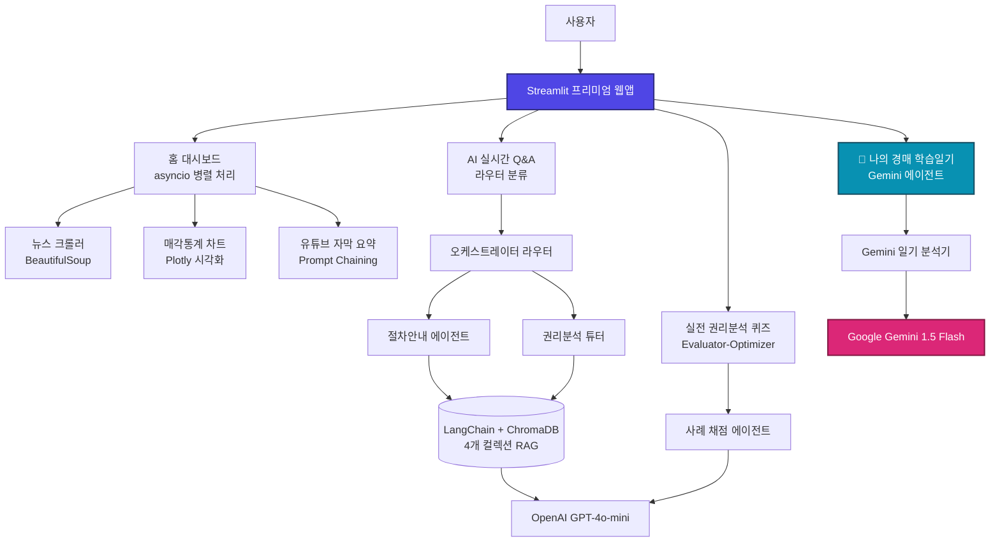

# 🏛️ 경매 학습 및 정보 플랫폼 - 새로운 개발계획서

> **최종 평가용 AI 에이전트 개발 교육과정 프로젝트**  
> **발표 예정일:** 2026년 6월 26일 (4인 1팀)

---

## 1. 프로젝트 목적 및 평가 최적화 전략
본 프로젝트의 핵심 목적은 실제 비즈니스 모델의 출시가 아니라, **"한 달간의 AI 에이전트 교육과정에서 습득한 핵심 기술요소들을 얼마나 깊이 있고 유기적으로 구현했는가"**를 증명하는 것입니다. 

따라서 실제 서비스 시 발생할 수 있는 데이터 라이선스, 비용 리스크 등은 최소화하는 방향(Mocking 및 Sample Data 활용)으로 우회하되, **엔트로픽(Anthropic)이 제시한 5대 AI 에이전트 패턴** 및 **Google Gemini(Gem) 연동**을 단일 애플리케이션 내에 조밀하게 녹여내어 기술적 완성도와 충실도를 극대화합니다.

---

## 2. 핵심 구현 아키텍처
본 플랫폼은 사용자가 부동산 법원경매의 복잡한 절차와 권리분석을 스스로 체득할 수 있도록 돕는 대시보드 및 멀티에이전트 시스템입니다.

### 2.1 시스템 흐름도 (Mermaid)


---

## 3. 기능 ↔ 커리큘럼 기술요소 ↔ 에이전트 패턴 매핑
발표 장표의 핵심이 될 기술 매핑 테이블입니다. 교육과정에서 다룬 거의 모든 필수 도구와 고급 설계 패턴이 반영되어 있습니다.

| 대화면/기능 | 세부 기능 | 시연 기술요소 | 적용된 에이전트 패턴 및 메커니즘 |
| :--- | :--- | :--- | :--- |
| **0. 대시보드 (홈)** | 경매 뉴스 피드 | BeautifulSoup4 크롤링 & RSS 파싱 | 정보 수집 파이프라인 |
| | 매각통계 | Plotly / Pandas 데이터 시각화 | 데이터 정제 및 동적 차트화 |
| | 유튜브 요약 | `youtube-transcript-api` 자막 추출 | **Prompt Chaining**: 자막 추출 ➔ 요약 ➔ 키워드 추출 |
| | 동시 수집 로딩 | `asyncio` 비동기 프로그래밍 | **Parallelization (병렬화)**: 다중 외부 소스 동시 로딩 |
| **1. AI 상담 (Q&A)** | 사용자 질문 분배 | LangChain, 의도 파악 임베딩 | **Routing (라우팅)**: 질문을 절차/개념/사례로 자동 분류 |
| | 전문 지식 탐색 | ChromaDB 벡터 DB, 조문 단위 청킹 | **Orchestrator-Worker**: 라우터가 적절한 에이전트에 작업 하달 |
| | 근거 제시 | RAG (Retrieval-Augmented Generation) | 법률 조문 단위 인용 출처(Citations) 팝업 제공 |
| **2. 권리분석 퀴즈** | 가상 물건 풀이 | 가상 등기부/임차인 정보 데이터 구성 | 실무 권리분석 프로세스 훈련 |
| | AI 채점 및 총평 | LLM 4개 부문(기준/대항력/인수/위험) 평가 | **Evaluator-Optimizer**: 답안 검증 및 점수/피드백 개선 루프 |
| **3. 경매 학습일기** | 일일 학습 기록 분석 | Google Gemini API 연동 | **Gemini Co-pilot**: 사용자 일기를 분석하여 감성 피드백, 실무적 리스크 및 오류 경고, 맞춤 학습 과제 제안 |

---

## 4. 신규 추가: 경매 학습일기 (Auction Diary) 콘텐츠 기획
학습자가 오늘 공부한 경매 이론이나, 입찰하고 싶은 가상 물건에 대한 메모, 혹은 모의 임장 일기를 자유롭게 작성하면 **Google Gemini API(Gem)**를 활용해 분석하는 기능입니다.

### 4.1 구현 목표
- 단순 챗봇이 아닌, **"학습 조력자(Tutor & Co-pilot)"**로서의 역할 강조
- OpenAI/Anthropic 위주의 RAG 파이프라인에 더해, **Google Gemini 프로바이더를 추가 연동**함으로써 멀티 모델 엔지니어링 능력을 입증

### 4.2 분석 파이프라인 (JSON 구조화 출력)
Gemini 프롬프트를 조율하여 사용자의 일기를 바탕으로 다음 구조화된 데이터를 생성합니다.
1. **`emotional_support`**: 학습 의지를 북돋아 주는 따뜻하고 공감 어린 피드백
2. **`risk_flags`**: 일기 내용 중 권리분석상 위험하거나 오해하고 있는 법률적 요소 경고 (예: 전입일자가 저당권보다 늦음에도 대항력이 있다고 착각한 경우 교정)
3. **`recommended_study`**: 보완이 필요한 용어(용어사전 팝업 연동) 및 추천 퀴즈 사례 ID 제시

---

## 5. 최종 발표(6/26) 대비 개발 마일스톤

```
[~6/21] 경매일기 백엔드 에이전트(Gemini) 설계 및 providers.py 확장 완료
[~6/22] Streamlit 앱 내 경매일기 탭 UI 추가 및 연동 완료
[~6/23] 1차 통합 테스트 및 QA (에이전트 라우터 분류 정확도, RAG 인용구 검증)
[~6/24] 발표 자료(PPT) 초안 작성 및 데모 영상/스크린샷 캡처
[~6/25] 리허설 및 배포 환경(Streamlit Cloud Secrets) 최종 점검
[06/26] 최종 프로젝트 발표 (데모 시연)
```

---

## 6. 개발 리스크 완화 계획

| 리스크 요인 | 발표 평가 영향도 | 대응 전략 |
| :--- | :--- | :--- |
| **실시간 경매 API 연동 실패** | 낮음 (교육용에 무관) | 대표성 있는 가상 사례 3~5건을 정교화하여 퀴즈 및 일기 시나리오에 활용 |
| **Gemini API 할당량/키 오류** | 높음 (데모 불가) | `.env`에 키가 없을 시 OpenAI로 자동 폴백(Fallback) 처리되도록 이중화 설계 |
| **Streamlit 배포 시 환경차이** | 보통 | SQLite/ChromaDB 파일을 Git에 보관하여 첫 실행 시 인제스천 없이 로드되도록 최적화 |
